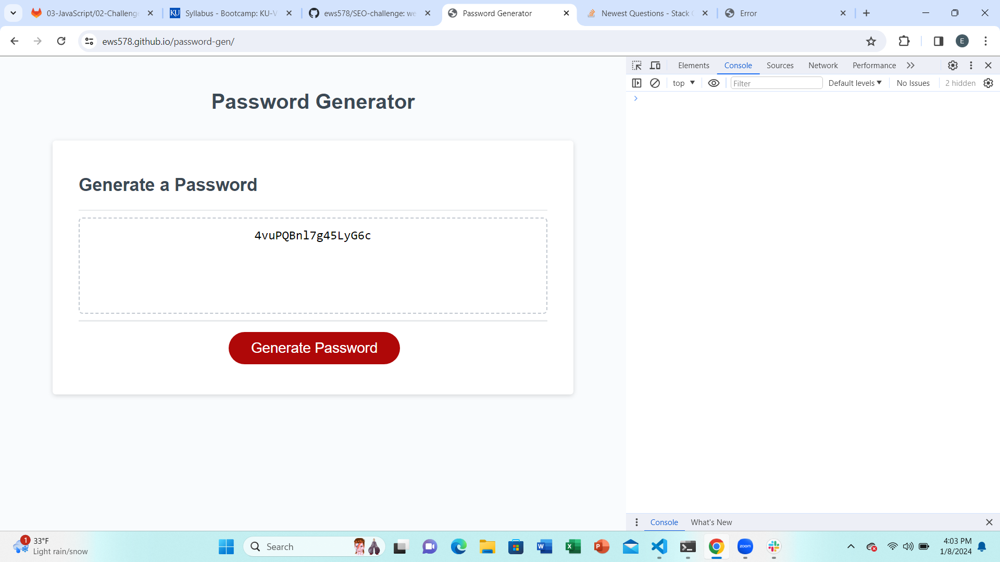

# password-gen
Password Generator Challenge

For this assignement I was given the task of taking the starter code and finishing the code to ensure the pasword  generator works as designed. It was a great exercise to put the if ,else, if else statements, varibles and fuctions that were taught this week into use to get the code to work as designed. I have made comments through out the process explaining in detail of the functions and variables I added each step of the way.

Attached is a screenshot of my code in live server and my url to my github repo.

https://ews578.github.io/password-gen/